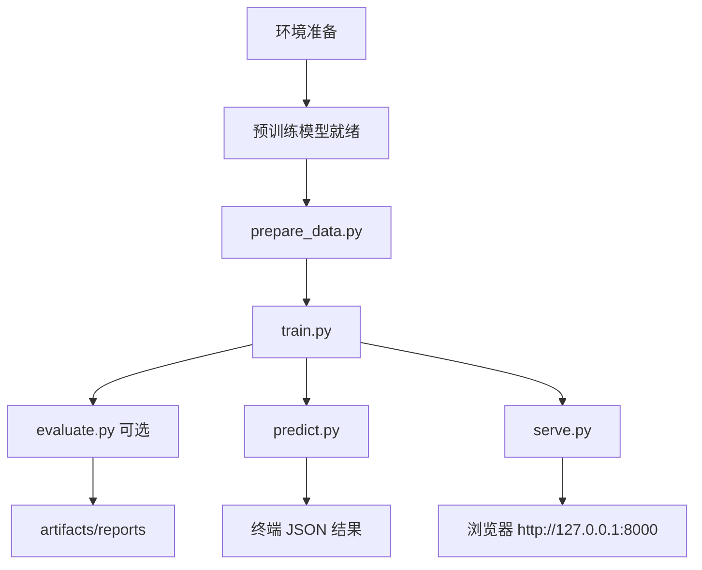

# BERT-TC 执行流程

本文按「从零跑通」的顺序，说明本项目每一步做什么、敲什么命令、产出什么文件。

默认假设：

- 已激活 conda 环境 `bert-tc`
- 当前工作目录是项目根目录 `BERT-TC/`
- 使用默认配置 [`configs/base.yaml`](../configs/base.yaml)
- 数据集为 `data/ChnSentiCorp/`，预训练模型已在本地

换其他数据集 / 多分类，请另见：[finetune_other_datasets.md](finetune_other_datasets.md)

---

## 0. 总览

```text
环境准备
  →（可选）下载预训练模型
  → 数据处理 prepare_data.py
  → 模型训练 train.py
  →（可选）单独评估 evaluate.py
  → 单条预测 predict.py  或  启动网页服务 serve.py
```



---

## 1. 环境准备

```powershell
conda activate bert-tc
cd D:\ai-workspace\LLM\BERT-TC
pip install -r requirements.txt
```

确认关键依赖可用：

```powershell
python -c "import torch, transformers, datasets, fastapi, matplotlib; print('ok')"
```

---

## 2. 预训练模型（首次需要）

若本地还没有中文 BERT：

```powershell
python models/downloads_model.py
```

下载后，默认路径应对齐配置中的：

```text
models/models/google-bert--bert-base-chinese
```

对应配置项：`paths.pretrained_model_dir`

---

## 3. 数据处理

### 命令

```powershell
python scripts/prepare_data.py
```

### 做什么

1. 从 `data/ChnSentiCorp/` 读取 `train / validation / test`
2. 解析标签名，生成 `label2id` / `id2label`
3. 统计各 split 文本长度（含 p95），写出 metadata

### 产出

```text
artifacts/processed/ChnSentiCorp/
├─ label2id.json
├─ id2label.json
└─ metadata.json
```

### 建议检查

打开 `metadata.json`，确认：

- `num_labels` 正确（当前情感二分类应为 2）
- `label_names` 符合预期
- `p95_text_length` 是否远大于配置里的 `max_length`

> 说明：`train.py` 训练时也会再调用一次数据处理逻辑，单独跑本步主要用于先验数据。

---

## 4. 模型训练

### 命令

```powershell
python scripts/train.py
```

### 做什么

1. 加载配置、固定随机种子
2. 加载预训练 BERT + 分类头
3. 分词并构建 DataLoader
4. 逐 epoch 训练；每个 batch 写 step 日志
5. 每个 epoch 结束后在验证集评估
6. 按验证集 **macro-F1** 保存 `best`，并始终更新 `last`
7. 验证集连续 `patience` 轮不提升则早停
8. 用 `best` 评估测试集，并生成曲线图 / 混淆矩阵图

### 产出

```text
artifacts/checkpoints/
├─ best/                  # 验证集最优模型（推理默认用它）
└─ last/                  # 最后一轮模型

artifacts/logs/
└─ train_history.csv      # 按 step 记录的训练日志

artifacts/reports/
├─ best_val_metrics.json
├─ test_metrics.json
├─ training_summary.json
├─ train_curves.png       # 横轴为 Step(batch)
└─ test_confusion_matrix.png
```

### 训练中可关注

- 终端每个 epoch 的 `train_loss / val_f1`
- `train_curves.png`：训练是否收敛、是否过拟合
- `test_confusion_matrix.png`：哪些类容易互相误判

---

## 5. 单独评估（可选）

训练结束已自动测过测试集。若要重新评估，或评估验证集：

```powershell
# 测试集
python scripts/evaluate.py --checkpoint best --split test

# 验证集
python scripts/evaluate.py --checkpoint best --split validation
```

### 产出

- `artifacts/reports/test_metrics.json` 或 `validation_metrics.json`
- 对应混淆矩阵图：`test_confusion_matrix.png` / `validation_confusion_matrix.png`

---

## 6. 单条文本预测

```powershell
python scripts/predict.py --text "这家酒店位置很好，服务也很周到。"
```

指定 checkpoint：

```powershell
python scripts/predict.py --text "服务太差了" --checkpoint best
```

### 输出示例（字段）

```json
{
  "text": "...",
  "label": "positive",
  "label_id": 1,
  "confidence": 0.98,
  "probabilities": {
    "negative": 0.02,
    "positive": 0.98
  }
}
```

---

## 7. 启动网页服务

```powershell
python scripts/serve.py
```

浏览器打开：

```text
http://127.0.0.1:8000
```

### 相关接口

| 方法 | 路径 | 说明 |
|------|------|------|
| GET | `/` | 网页演示页 |
| GET | `/health` | 健康检查 |
| POST | `/predict` | JSON 推理接口 |
| GET | `/static/...` | 前端静态资源 |

停止服务：在终端按 `Ctrl + C`

---

## 8. 推荐日常执行顺序（最短路径）

第一次完整跑通：

```powershell
conda activate bert-tc
cd D:\ai-workspace\LLM\BERT-TC

# 如本地还没有模型，先下载
python models/downloads_model.py

python scripts/prepare_data.py
python scripts/train.py
python scripts/predict.py --text "房间干净，交通方便"
python scripts/serve.py
```

之后若只做推理（已有 `artifacts/checkpoints/best`）：

```powershell
python scripts/predict.py --text "你的文本"
# 或
python scripts/serve.py
```

---

## 9. 常见中断点

| 现象 | 可能原因 | 处理 |
|------|----------|------|
| 找不到预训练模型 | 未下载或路径不对 | 检查 `paths.pretrained_model_dir` |
| 找不到 checkpoint | 还没训练，或目录被删 | 先跑 `train.py` |
| CUDA OOM | batch / max_length 过大 | 减小 `batch_size` 或 `max_length`，或开 `use_fp16` |
| 预测标签仍是旧类别 | 换数据后复用了旧权重 | 清掉 `artifacts/checkpoints` 后重训 |
| 网页能开但预测失败 | 模型未加载成功 | 看 `serve.py` 启动日志，确认 best 目录存在 |

---

## 10. 相关文档

- 项目总览与结构：[README.md](../README.md)
- 换数据集 / 多分类微调：[finetune_other_datasets.md](finetune_other_datasets.md)
- 默认配置：[configs/base.yaml](../configs/base.yaml)
